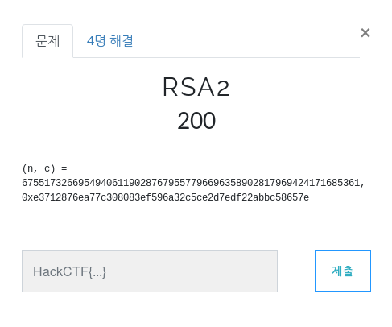
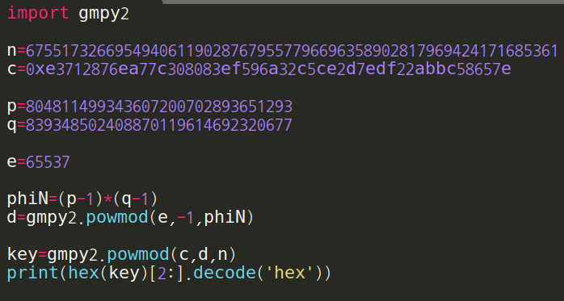
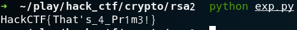

# RSA2

**Category:** Crypto

**Source:** HackCTF

**Points:** 200

**Author:** galaxy(김경환)

**Description:** 

> 

## Point
RSA

## Write-up

문제에 RSA에 사용되는 n과 encrtypt된 c가 있습니다.

n을 factordb에 검색하면 p,q를 알아 낼 수 있습니다.

찾은 p,q를 기준으로 phiN을 찾습니다.

e를 알아야 d를 구할 수 있어 decrypt가 가능합니다. 

e는 phiN보다 작고 phiN과 서로소인 수인데 소수를 사용하면

어느 수와도 서로소이기 때문에 보통 소수를 많이 사용합니다.

대충 e를 65537로 가정하고 d를 구하고 decrypt를 하니 flag가 나왔습니다.

Flag : HackCTF{That's_4_Pr1m3!}

## References
factordb.com(n을 구성하는 p,q를 찾을 때 사용)