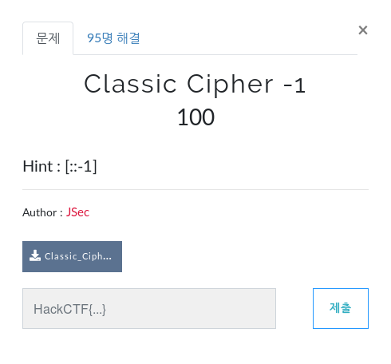
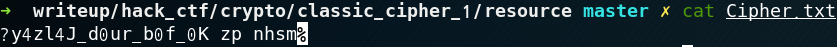
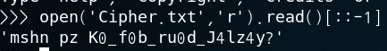

# Classic Cipher - 1

**Category:** Crypto

**Source:** HackCTF

**Points:** 100

**Author:** galaxy(김경환)

**Description:** 

> 
> 

## Point
카이사르암호

## Write-up

문제 hint에 적혀있는 것처럼 [::-1]을 이용해서 역으로 출력했습니다.

> 

flag가 바로 나오지 않고, flag형태인 HackCTF{}와도 일치하지 않습니다.

guessing으로 도입부가 flag is는 아닐까 하고 flag is와 xor, distance를 구했습니다. xor은 일정한 패턴이 나오지 않았지만 distance에서는 7이 나왔습니다.

구한 distance를 토대로 decrypte하니 flag가 나왔습니다.

flag가 D0_y0u_kn0w_C4es4r?라고 하니 

포멧에 맞게 HackCTF{} 안에 넣어서 제출했습니다.

Flag : HackCTF{D0_y0u_kn0w_C4es4r?}

