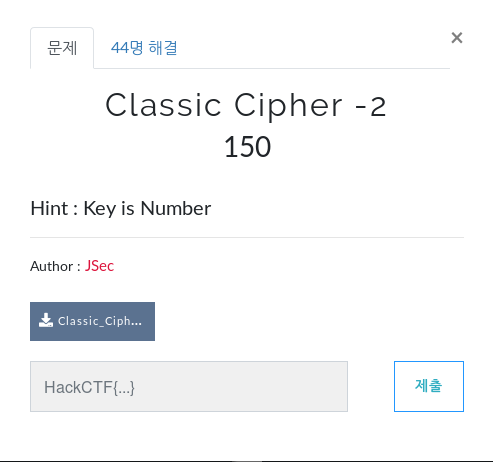
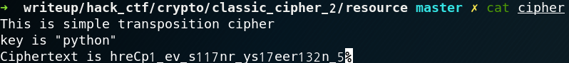
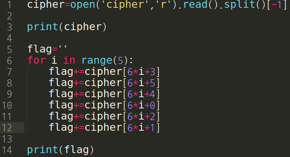
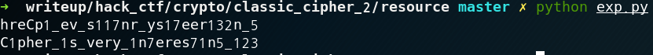

# Classic Cipher - 2

**Category:** Crypto

**Source:** HackCTF

**Points:** 150

**Author:** galaxy(김경환)

**Description:** 

> 
> 

## Point
Transposition cipher

## Write-up

주어진 cipher에 "This is simple transposition cipher"라고 있습니다.

transposition cipher의 복호화 방법은

key 길이 만큼 뽑은 뒤 각 key의 순서대로 재배치 하는 것입니다.

주어진 key는 python이고, 이를 숫자로 치환하면 465132가 됩니다.

따라서 key길이 만큼 잘라놓은 각 문자열에서 465132순서대로 재배치하면

flag가 나타납니다.

> 

> 

Flag : HackCTF{C1pher_1s_very_1n7eres71n5_123}

## References
https://en.wikipedia.org/wiki/Transposition_cipher