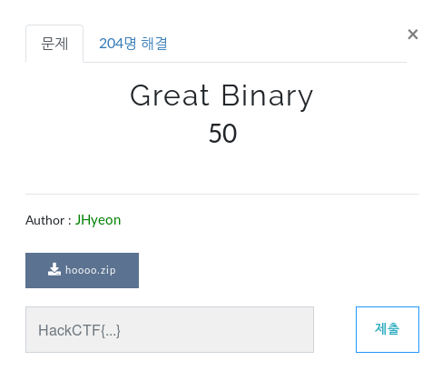
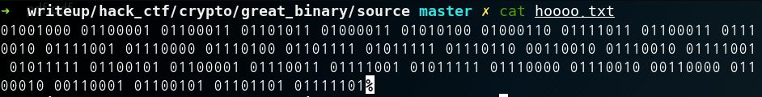
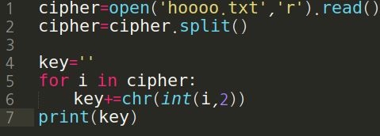

Great Binary

**Category:** Crypto

**Source:** HackCTF

**Points:** 50

**Author:** galaxy(김경환)

**Description:** 

> 

## Write-up

주어진 zip file을 unzip 하면 0과 1로 이루어진 hoooo.txt가 나옵니다.

바이너리로 구성되어 있다고 생각해서 decrypte시켜주는 python코드를 짜서 decript시켜줍니다.

decrypt된 flag가 나타납니다.

Flag : HackCTF{crypto_v2ry_easy_pr0b1em}

