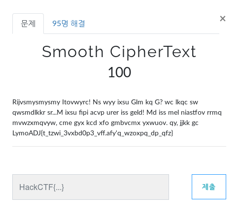
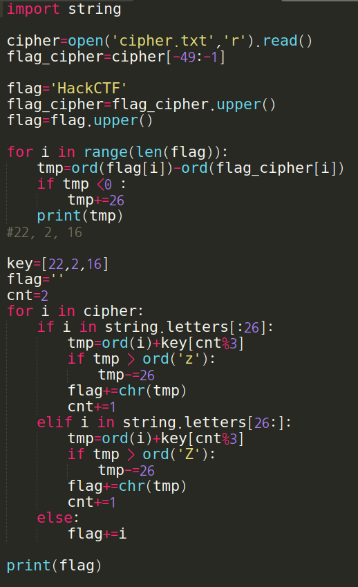
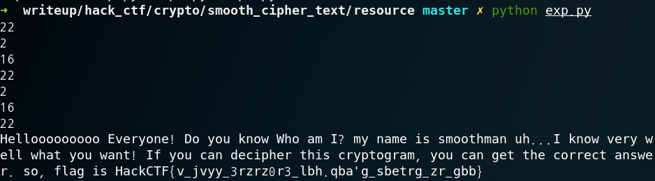
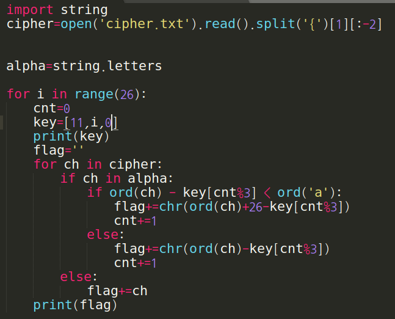
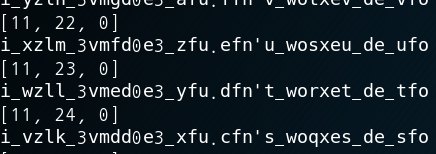
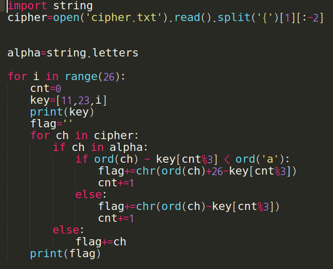
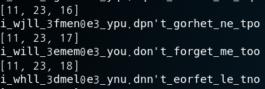

Smooth CipherText

**Category:** Crypto

**Source:** HackCTF

**Points:** 100

**Author:** galaxy(김경환)

**Description:** 

> 

## Write-up

문제 화면에 cipher text가 있습니다.

제일 밑줄에 flag의 형태가 보여서 우선 알고 있는 'HackCTF'와 'LymoADJ'를 비교합니다.

xor또는 distance를 구하는 방법중 xor은 일정한 패턴이 나오지 않았고 distance에서 일정한 패턴이 나왔습니다.

구한 패턴으로 암호문을 decrypt합니다.

찾아낸 flag가 이상하지만 일단 입력을 해보니 오답이라고 나옵니다.

flag 중괄호 내의 key와 문제의 key가 달라서 key를 유추하기 시작합니다.

key길이는 문제와 동일하게 3이라고 가정하고 제일 처음에 한글자만 있으니 i라고 가정합니다.

i라고 가정한 다음 2번째 key를 찾기위해 0~25까지 일때의 decrypt된 flag들을 출력해봅니다.

2번째 key값이 23인 부분에서 2번째 단어의 형태가 will이 아닐까 하고 추측하고 

3번째 key를 찾는 python code를 작성합니다.

3번째 key값이 17일때 flag가 나타납니다.

Flag : HackCTF{i_will_3emem0e3_you.don't_forget_me_too}

## References
지순님의 도움