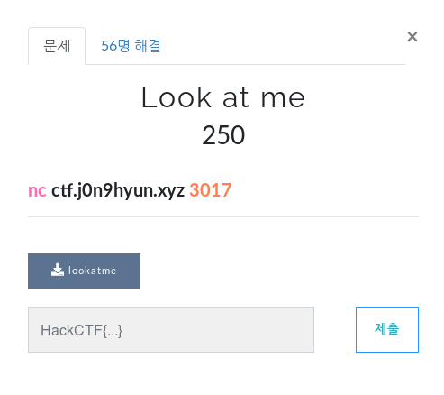
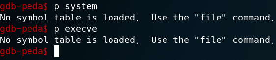
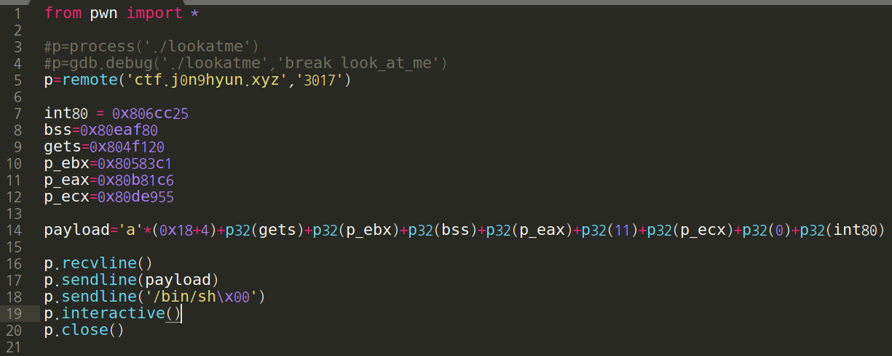
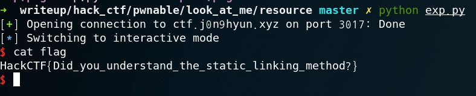

# Look at me

**Category:** Pnwable

**Source:** HackCTF

**Points:** 250

**Author:** galaxy(김경환)

**Description:** 

> 

## Point
sys rop(SROP)

## Write-up

주어진 binary파일에 system, execve가 없습니다.

system, execve가 없어서 /bin/sh를 입력하더라도 실행시킬 방법이 없어

인터넷에 찾아보니 sys rop라는 개념이 있었습니다.

sys rop는 interrupt를 발생시켜 원하는 sys 함수를 호출하는 것입니다.

int 0x80이 마침 binayr에 있었기 때문에 eax,ebx,ecx 잘 조작하면 원하는

원하는 sys 함수를 호출 할 수 있습니다.

payload를 짜는 방식은 gets를 호출시켜서 bss영역에 "/bin/sh"를 입력하고

bss영역을 인자로 sys_execve를 호출 시키는 방법입니다.

sys_execve는 syscall table을 참조하면 eax가 11일때 호출 합니다.

따라서 eax = 11, ebx = bss, ecx = 0을 넣어서 호출합니다.

마지막에는 syscall이 호출될 수 있게 int 0x80을 호출해야합니다.

(payload = dummy(0x18+4) + gets + pop_ebx_ret + bss + pop_eax_ret + 11 + pop_ecx_ret + 0 + int 0x80)

Flag : HackCTF{Did_you_understand_the_static_linking_method?}

## References
syscall table : syscalls.kernelgrok.com
