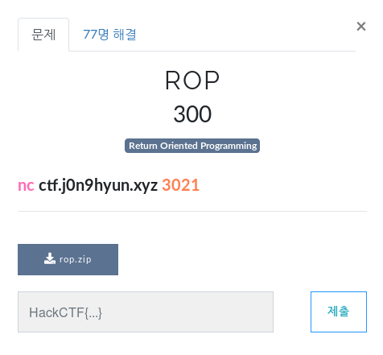
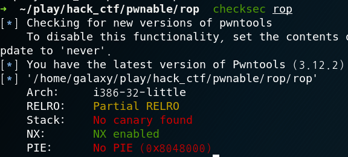

# ROP

**Category:** Pwnable

**Source:** HackCTF

**Points:** 300

**Author:** galaxy(김경환)

**Description:** 

> 
> 

## Point
ROP

## Write-up

기초적이 rop문제입니다.

canary가 없기 때문에 ret주소를 덮어 쓸 수 있습니다.

우선 ida로 decompile해보았습니다.

main에서 vulnerable_function을 호출하고 

vulnerable_function에서 read를 호출하는데 이때 bof가 가능해서 

ret주소를 덮어 쓸 수 있습니다.

???왜 got를 덮어쓰는가...
바로가면안되는가...???

Flag : **_submit 한 flag_**

## References
_문제를 풀면서 도움을 받은 사이트들_

_표 또는 리스트로 작성_
