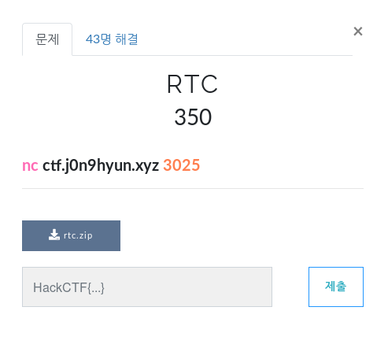
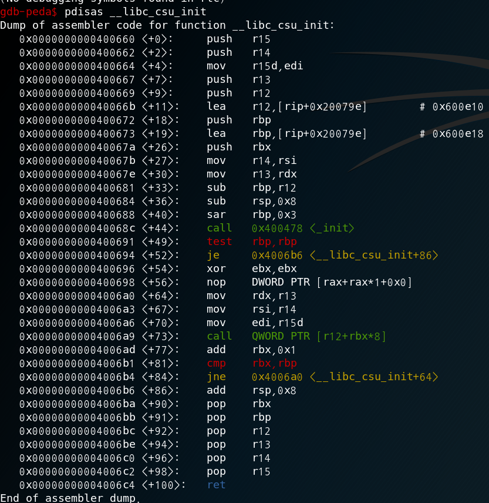
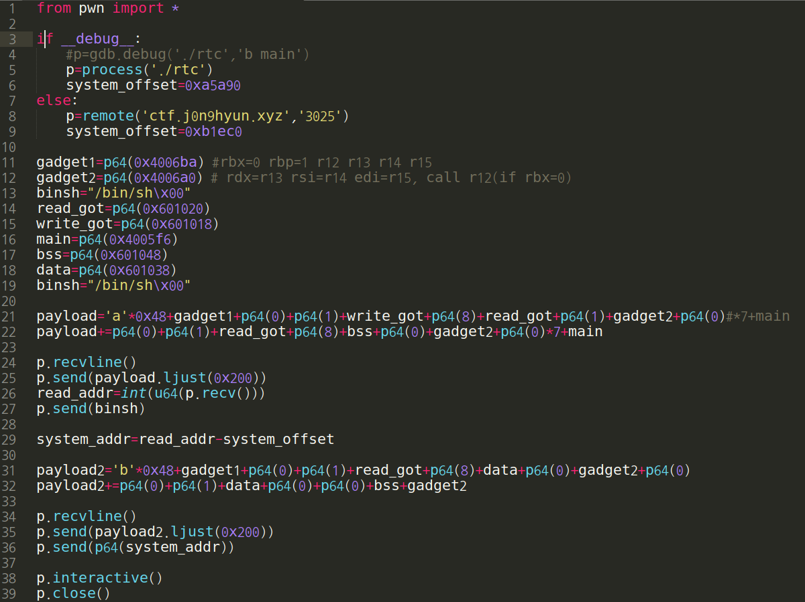
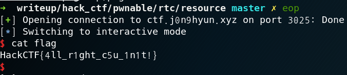

# RTC

**Category:** Pwnable

**Source:** HackCTF

**Points:** 350

**Author:** galaxy(김경환)

**Description:** 

> 

## Point
return to csu

## Write-up

이번 문제는 가젯이 마땅한게 없었다. rdi, rsi, rdx, rax를 수정해야 syscall도 부를 수 있고, rdi,rsi,rdx를 수정해야 rop가 가능한데 gadget이 마땅히 나오지 않았다.

문제 이름인 rtc를 검색했다. return to csu란 __libc_csu_init부분의 gadget을 사용하는 기법이다.

csu에 있는 gadget은 (+90)부분에서 rbx, rbp, r12, r13, r14, r15를 pop하고 ret하는 부분과, (+56)부분에서 이렇게 받은 값들을 적절한 레지스터에 배치하는 부분이 있다.

call에서 r12+rbx*8인데 rbx를 0으로 입력하면 r12에 있는 주소를 호출한다.

따라서 rbx=0, r12는 함수의 got부분을 입력해줍니다.

cmp rbx, rbp후 jmp를 안하기 위해서 rbp는 0을 줍니다.

r13은 rdx로, r14는 rsi, r15는 edi로 갑니다. r15는 4byte만 가는점을 주의해야 합니다.

rdi, rsi, rdx를 원하는데로 조정할 수 있으니 rop를 할 수 있습니다.

exploit과정은 이렇습니다.

먼저 system의 주소를 알아야 하기에 read의 주소를 알아냅니다.

문제에서 준 library에서 read - system 간의 offset을 알아냅니다.

위에서 구한 실제 read의 주소와 offset으로 실제 system 주소를 계산합니다.

"/bin/sh"을 쓰기 가능한 영역에 입력합니다(bss영역은 stdin이 사용하고 있어서 data영역에 잡았습니다.)

알아낸 system주소를 got역할을 해줄 어딘가에 저장합니다.(data영역에 썼습니다.)

"/bin/sh"을 인자로 system을 호출합니다.

Flag : HackCTF{4ll_r1ght_c5u_1n1t!}
