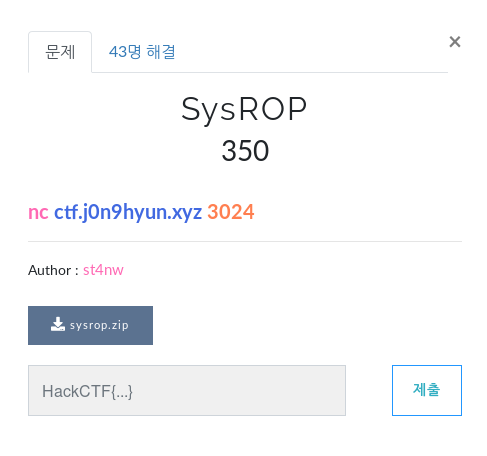

# sysROP

**Category:** Pwnable

**Source:** HackCTF

**Points:** 350

**Author:** galaxy(김경환)

**Description:** 

> 

## Write-up

우선 sysrop를 ida로 보니 read외에는 함수가 보이지 않습니다.

write, system, execve다 안되기 때문에 syscall을 찾았습니다.

read에서 syscall을 사용하고 있기 때문에 해당 부분을 활용하려 합니다.

exploit과정은 다음과 같습니다.

read를 호출해서 data영역에 "/bin/sh\x00"을 입력해줍니다.
(bss영역은 stdout이 사용하고 있습니다.)

read를 호출해서 read_got에 있는 read시작 주소값 마지막 한바이트를 read안에 있는 syscall의 주소로 바꿔줍니다.(주소가 바뀌더라도 하위 2byte는 바뀌지않음)

우선 payload에 사용할 gadget을 찾습니다.

rdi, rsi, rdx를 수정하는 부분이 필요하고

마지막에 syscall에 사용할 rax, rdi, rsi, rdx부분이 필요합니다.

0x4005ea에 조건을 충족하는 gadget이 있습니다.(rax를 안쓸때는 0x4005eb부터 사용하면 됩니다.)

read에서 덮어 쓸 syscall의 주소를 알아옵니다.

제공받은 library에서 찾습니다.

syscall 주소의 하위 1byte는 5e입니다.

필요한 부분을 다 찾았으니 exploit을 작성합니다.

**
sendline()으로 보내니 \n이 buffer에 쌓여서 올바른 결과가 나오지 않았음
send할때 ljust()를 사용해서 buffer의 크기만큼 sync를 맞춰줌
이번문제에서는 recv를 하지 않아서 sync가 안맞음
따라서 값들을 밀어넣고 buffer에 쌓여있는 값들을 크기만큼 가져가다보니
원하는 데로 들어가지 않았음

Flag : HackCTF{D0_y0u_Kn0w_sysc411?}

## References
