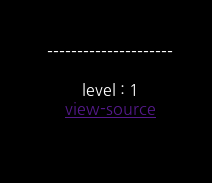
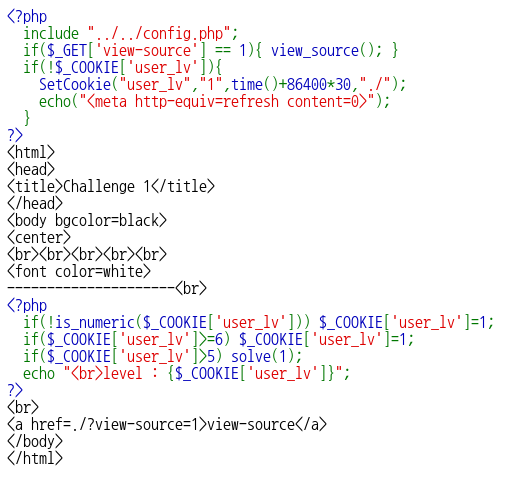
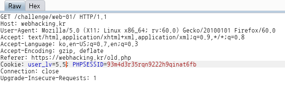
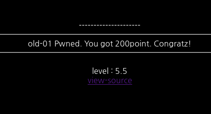

# old-01

**Category:** Web

**Source:** Webhacking.kr

**Points:** 200

**Author:** galaxy(김경환)

**Description:** 

> 

## Write-up

문제에서 level1이라고 나오고 view-source를 통해 php source를 보여줍니다.

cookie의 user_lv값이 6이상이면 1로 셋팅이되고, 5를 초과해야지 solve를 보여줍니다.

따라서 우리는 5'<'user_lv'<'6을 만들어 줘야 합니다.

위처럼 user_lv를 만족하는 값으로 수정하여 보내줍니다.

정답을 맞춘 화면이 나타납니다.

Flag : Flag 없음