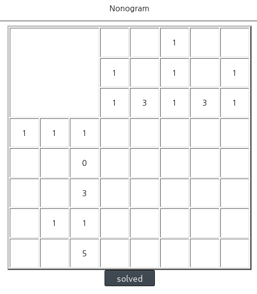
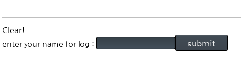
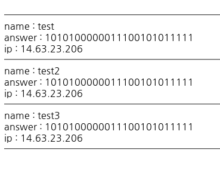
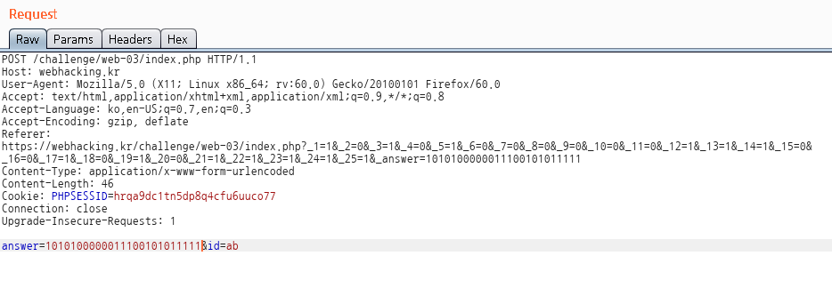
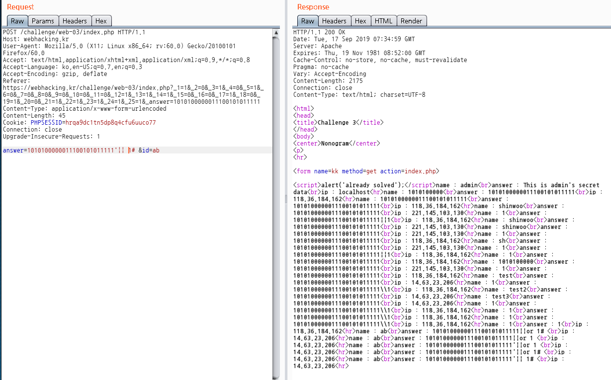

# old-03

**Category:** Web

**Source:** webhacking.kr

**Points:** 350

**Author:** galaxy(김경환)

**Description:** 

> 

## Write-up

문제화면은 익숙한 네모네모로직입니다.

간단한문제여서 바로 풀었습니다.

name을 입력하라는 창이 나옵니다.

여러번 테스트해보니 기록이 쌓이는 곳입니다.

넘어가는 패킷을 잡으니 answer과 id가 있습니다.

id에 sql injection이 가능한가 몇가지를 입력해 보았으나

문자열처리되어서 그대로 나옵니다.

answer에 입력하니 query error라는 결과가 나타납니다.

또한 answer를 여러가지로 조작해보니 결과화면이 answer값을 기준으로 나타납니다.

즉 select where에 answer값이 들어갑니다.

따라서 항상 참이게 만들어 주니 입력된 모든 data가 나타나며 exploit에 성공했습니다.

