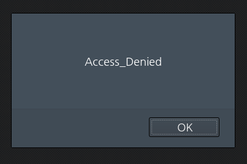
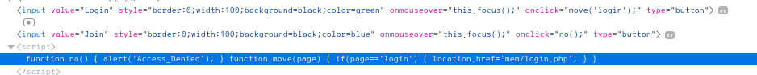
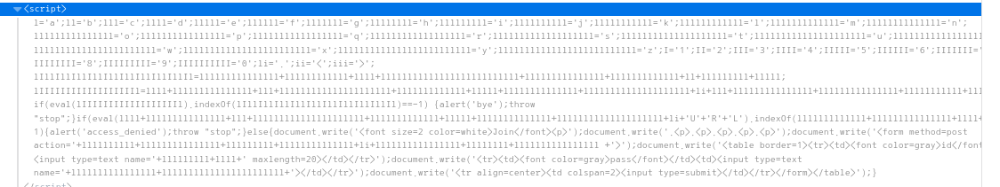
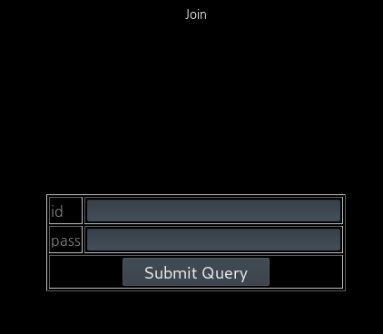

# old-05

**Category:** Web

**Source:** Webhacking.kr

**Points:** 300

**Author:** galaxy(김경환)

**Description:** 

> 

## Point
javascript, insert에러(문자열 제한)

## Write-up

문제화면에는 아무것도 안나타 납니다.

login 버튼을 누르면 login 페이지가 나타납니다.

sql injection을 시도해 보았지만 필터링 되는지 시도되지 않았습니다.

다시 메인페이지에서 join버튼을 눌렀습니다.

Access_denied가 나타납니다.

소스를 보니 join 버튼은 alert기능 만 있습니다. 

login버튼은 mem/login.php로 연결 되어 있습니다.

mem/join.php도 있지 않을까 하고 guessing했습니다.(mem으로 가서 디렉터리 정보를 봐도 됩니다.)

mem/join.php로 접근하니 bye가 alert됩니다.

소스를 보니 중간에 난독화가 되어있는 script가 있습니다.(기술이 없어 열심히 손으로 해독했습니다 ㅜㅜ)

내용은 cookie에 oldzombie라는 문자열이 있어야 하며, url에 mode=1이라는 문자열이 있어야 합니다.

cookie에 oldzombie라는 cookie를 만들었지만 우회되지 않았습니다.(다른분의 writeup을 보니 sessionid 뒤에 oldzombie를 추가해줬습니다. 그런데 이러면 seesion은 어떻게 되는지....?)

그래서 저는 스크립트상에서 해당부분을 지워버렸습니다.

회원가입 table이 보입니다.

admin으로 회원가입을 진행하니 이미 존재하는 id라고 나옵니다.

귀찮아서 burp의 repeat를 사용하다보니 자연스럽게 script의 글자수 제한을 우회 했습니다.

admin뒤에 %0a를 입력해줘서 공백을 넣어주니 join이 성공했습니다.

동일하게 login 페이지에서도 burp로 parameter를 수정해서 admin%0a를 넣어주니 exploit에 성공했습니다.

왜 이런지 알아보려고 다른분들의 writeup을 참고했습니다.

column에 글자수 제한이 있을때 해당글자수보다 더 많은 문자열을 insert하려하면

글자수까지만 인식이 되고 뒷부분은 날려버린다고 합니다.

그래서 admin이 있어도 admin%a0라고 하니 admin 까지만 인식되고 insert가 됐습니다.

즉, %a0뿐만아니라 어떤 문자든 넣어도 됩니다.

(local환경에서 test해보니 문자열이 너무 길다고 error를 도출했습니다.

version차이인건지....패치된건지.....ㅜ)
