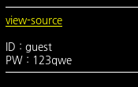
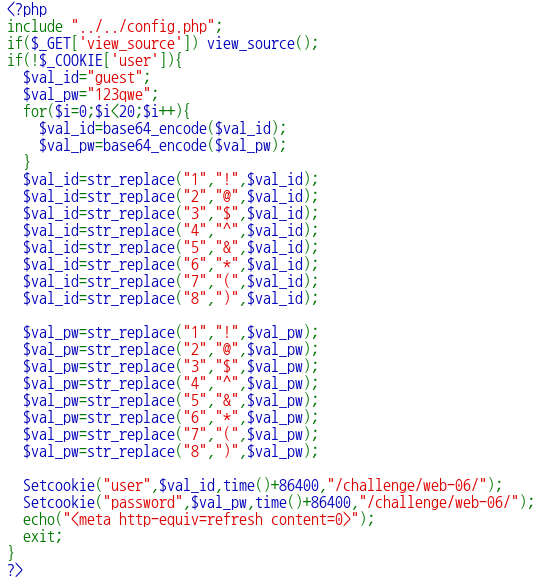
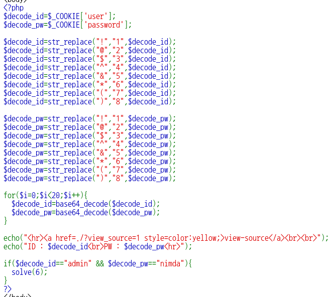

# old-06

**Category:** Web

**Source:** Webhacking.kr

**Points:** 100

**Author:** galaxy(김경환)

**Description:** 

> 

## Write-up

문제화면에서 id와 pw가 입력되어있습니다. view-source가 있으니 source부터 봤습니다.




source중 윗부분은 cookie에 user가 없으면 id와 password를 guest, 123qwe로 입력합니다.

그 후 encoding과정을 거칩니다.

숫자를 특수문자로 바꾸고 base64로 encoding을 20번 중복해서 합니다.

source중 아래부분은 위에서 encoding한 부분을 decoding해주는 부분입니다.

user와 password의 숫자를 특수문자로 바꿔줍니다.

base64 decoding을 20번 반복합니다. 

이렇게 나온 값이 id는 admin, pw는 nimda이면 solve를 호출합니다.

우리는 최종적으로 admin/nimda의 encoding한 부분을 알아야 합니다.

python으로 간단하게 exploit코드를 작성해서 admin/nimda의 encdoing한 값을 알아냈습니다.

```python
import base64

id='admin'
pw='nimda'

for i in range(20):
	id=base64.b64encode(id)
	pw=base64.b64encode(pw)
print('id is '+id)
print('pw is '+pw)
```
이렇게 구한 값을 cookie의 user, password에 입력해주면 pwned됩니다.

(숫자를 특수문자로 바꿔주는 부분을 구현하지 않은 이유는 우리가 원하는 id/pw에 숫자가 없기 때문입니다.)