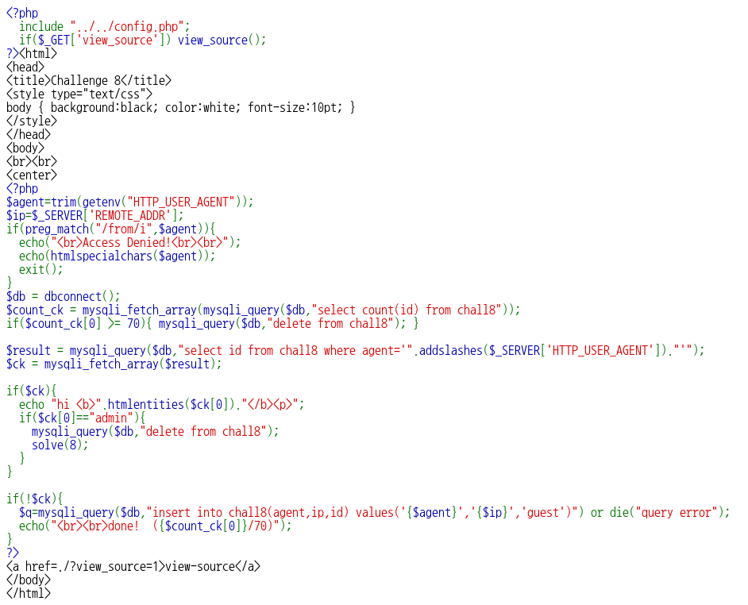

# _Old-08_

**Category:** _Web_

**Source:** _Webhacking.kr_

**Points:** _350_

**Author:** _galaxy(김경환)_

**Description:** 

> 

## Point
sql 다중insert

## Write-up

main화면에서는 특별한게 없으니 source를 봅니다.

header의 user agent의 값을 agent변수로 받습니다.

ip는 제 ip를 받습니다.

preg_match에서 agent에 from이 포함되어 있으면 access_dined를 띄우고 종료합니다.

다음 부분에서는 chall8테이블에서 id갯수가 70개가 되면 테이블을 비워줍니다.

위에서 받은 agent를 조건으로 id를 가져옵니다. 가져온 id가 admin이면 solve를 호출합니다. 즉, agent를 조건으로 가져온 id가 admin이 여야 합니다.

해당부분을 우회하려고 sql injection을 시도 했지만 도지 않았습니다.

뒷부분이 agent를 기준으로 id를 검색했을때 결과가 없으면 agent와 id를 기준으로 새로 값을 생성합니다.

sql문을 보면 id값이 guest로 고정이 되어있습니다.

여기서 입력하는 agent를 이용해서 2개의 record가 insert 되도록 했습니다.

insert into 테이블명(칼럼명) values(값1),(값2)... 이런식으로 한번에 여러개를 insert할 수 있습니다.

따라서 포멧에 맞게 agent에 "abc','123','admin'),('bcd"를 입력해 주었습니다.

정상적으로 record가 생성이 되었으니 abc로 로그인하면 solve가 호출 됩니다.
