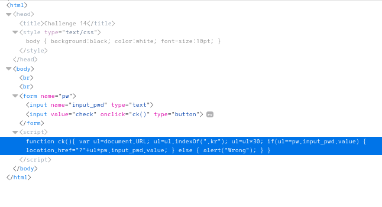
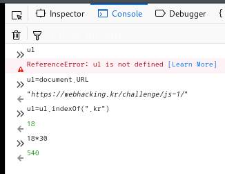

# _Old-14_

**Category:** _Web_

**Source:** _Webhacking.kr_

**Points:** _100_

**Author:** _galaxy(김경환)_

**Description:** 

> 

## Write-up

문제화면에 아무값이나 입력하고 check를 하니 Wrong이 나타납니다.

우선 어떻게 구성이 되어있는지 source를 보았습니다.

check를 누르면 script가 실행되게 되어있습니다.

script의 내용을 보면 URL에서 ".kr"의 index값 * 30의 값을 입력하면

입력한 값과 위에서 찾은값을 곱해서(i.e. 위에서 찾은 값의 제곱) get parameter로 전송합니다.

(bruteforce로 찾는걸 방지하려고 큰수를 만든듯 합니다.)

firefox에 있는 console을 활용해서 index값과 최종 입력값을 찾았습니다.

