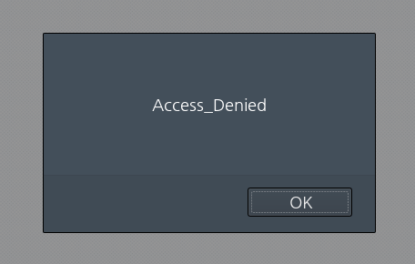

# _Old-15_

**Category:** _Web_

**Source:** _Webhacking.kr_

**Points:** _50_

**Author:** _galaxy(김경환)_

**Description:** 

> 

## Write-up

문제 화면에서 access_denied가 나타나고 다시 문제리스트 화면으로 돌아갑니다.

js문제기때문에 들어오는 response를 잡아서 보았습니다.

response에 보면 script로 alert하고 문제리스트로 돌아가는 부분이 있습니다. 해당 부분을 지우고 forward시킵니다.

getflag링크가 나타나고 해당 링크를 누르면 pwned됩니다!!

