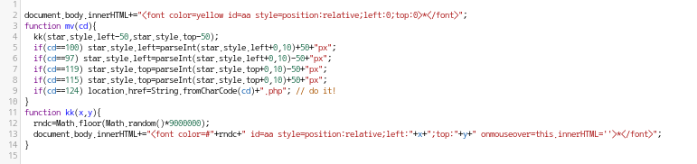

# _Old-16_

**Category:** _Web_

**Source:** _Webhacking.kr_

**Points:** _100_

**Author:** _galaxy(김경환)_

**Description:** 

> 

## Write-up

문제화면에는 간단하게 \*만 찍혀있습니다.

특정키를 누르면 위에 아주 작은 \*이 찍힙니다.

js문제이니 source부터 봅니다.

중간 script를 보면 key입력에 따라 \*의 위치가 바뀌도록 되어있습니다. 각 w,a,s,d를 방향키처럼 사용하게 끔 나타나있고 |를 누르면 |.php로 넘어가게 되어있습니다.

하지만 아무리 키를 눌러보아도 작은 \*만 생성되고 큰 \*이 이동하거나 페이지가 넘어가지 않습니다.

실제 입력하는 키보드의 값이 ascii값과는 다른값인듯 하여 값을 직접 주었습니다.

source에서 body 부분의 onkeypress="mv(124)"로 수정합니다.

아무키나 누르면 |.php로 넘어가서 pwned됩니다.

다른 방법으론 그냥 url에 |.php를 입력해도 됩니다.

