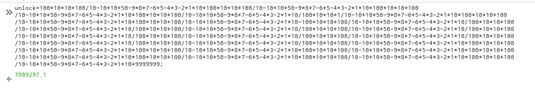

# _Old-17_

**Category:** _Web_

**Source:** _Webhacking.kr_

**Points:** _100_

**Author:** _galaxy(김경환)_

**Description:** 

> 

## Write-up

문제화면에는 단순한 입력폼만 있습니다.

이것저것 입력해보니 Wrong만 나타나서 source를 봤습니다.

script를 보면 아주 긴\~\~\~수식의 값이 unlock 변수로 들어갑니다.

내가 입력한 값이 이 unlock의 값과 동일하면 unlock/10을 parameter로 호출합니다.

firefox에 console에 해당 수식을 복붙하면 결과가 나타납니다.

해당 결과를 제출하면 pwned됩니다.

(문제를 풀고나서 writeup을 쓰려고 다시 할때는 solved화면이 나타나지 않았습니다.

url에 unlock/10의 값을 url뒤 parameter로 주니 solved창이 나타났습니다.)
