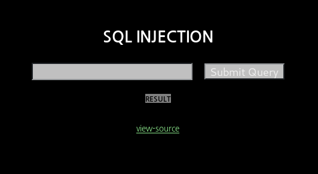
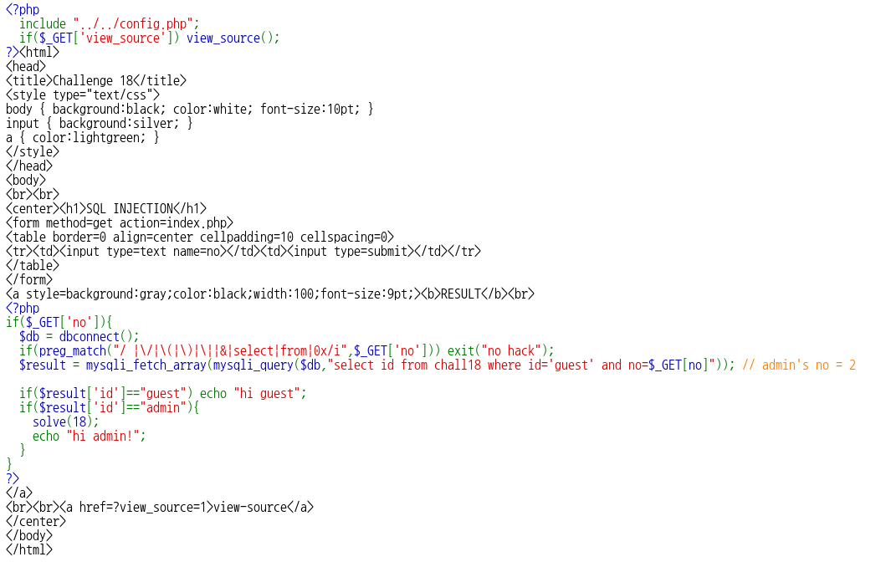
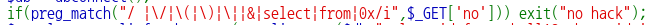
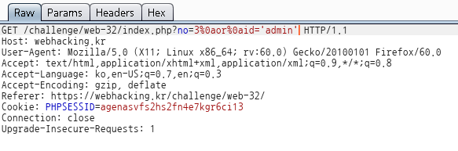

# _Old-18_

**Category:** _Web_

**Source:** _Webhacking.kr_

**Points:** _100_

**Author:** _galaxy(김경환)_

**Description:** 

> 

## Point
- _공백문자 우회_

## Write-up

문제화면에 떡하니 SQL INJECTION이라고 나와있습니다.

문제에 view-source가 있으니 우선 source부터 보았습니다.

query를 보면 where문으로 id='guest',no=$\_GET[no]로 되어있습니다.

query의 결과인 result['id']의 값이 admin이면 solve를 호출합니다.

따라서 우린 query의 결과를 admin으로 만들어야 합니다.

간단하게 no parameter에 3 or id='admin'을 주었습니다. 

no hack이라는 결과가 나왔습니다.

다시 source를 자세히 보니 preg_match로 필터링을 하고 있습니다.

제가 제출한 답에는 공백이 포함되어 있어서 no hack이 나타났습니다.

공백을 우회하는 문자들 중에 한개를 선택해서 request가 날라갈때 burp로 잡아서 수정해 주었습니다.

pwned되었습니다!!

