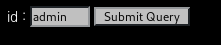
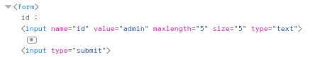
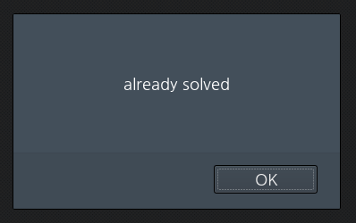

# _Old-19_

**Category:** _Web_

**Source:** _Webhacking.kr_

**Points:** _150_

**Author:** _galaxy(김경환)_

**Description:** 

> 

## Write-up

문제화면에는 입력폼이 보입니다.

아무값을 입력하니 login이 되었습니다. db는 아닌것 같아 sql injection은 아니라고 생각합니다.

우선 admin으로 로그인을 해야하는데 특징이 form의 입력값이 5글자로 제한되어 있습니다.

앞에서 비슷한 문제로 나왔었던 기억이 있는데 이렇게 글자수가 제한 되어 있으면

뒤에 특정 문자를 넣어서 우회가 가능했었습니다.

이번에도 form에서 글자수를 늘리고 '를 추가 했습니다.

pwned되었습니다.