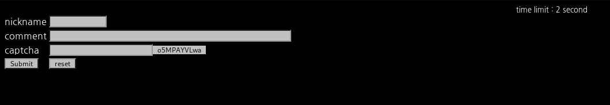

# _Old-20_

**Category:** _Web_

**Source:** _Webhacking.kr_

**Points:** _200_

**Author:** _galaxy(김경환)_

**Description:** 

> 

## Write-up

문제화면에는 nickname, comment입력과 captcha가 있습니다.

위에 time limit : 2 second 라고 되어 있는것을 보니 2초안에 모든내용을 입력해야 하는 듯합니다.

우선 captcha가 계속해서 변하기 때문에 손으로 2초만에 입력하는것은 사실상 불가능 합니다.

source를 보면 script가 있습니다.

이 부분을 활용할 예정입니다. firefox에선 console을 활용해서 script를 동작시키는 것과 비슷한 효과를 줄 수 있습니다.

위 script에서 우리가 필요한 부분만 조금 수정해서 만들었습니다.

위의 스크립트를 새로고침후 2초안에 console에서 실행시켜주면 pwned됩니다.

(처음에는 python으로 작성해서 request를 보내려했는데 왜때문인지 python으로 작성한 script는 동작하지 않았습니다...)
