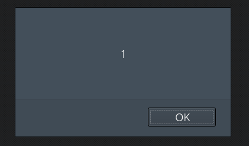

# _Old-23_

**Category:** _Web_

**Source:** _Webhacking.kr_

**Points:** _200_

**Author:** _galaxy(김경환)_

**Description:** 

> 


## Write-up

문제화면에서 ```<script>alert(1);</script>```를 inject해야 한다고 적혀있습니다.

우선 어떤게 필터링이 되는지 이것저것 넣어봤는데 글자가 2자 이상이되면 필터링이 됩니다. 다른 어떤 특수문자도 필터링은 되지 않습니다.

각 글자들을 떨어뜨려 줘야 하는데 여기서 null(%00)을 사용했습니다.

각 글자 사이사이마다 %00을 넣어서 보내면 pwned됩니다.


