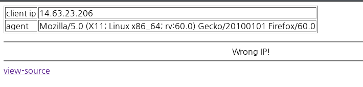
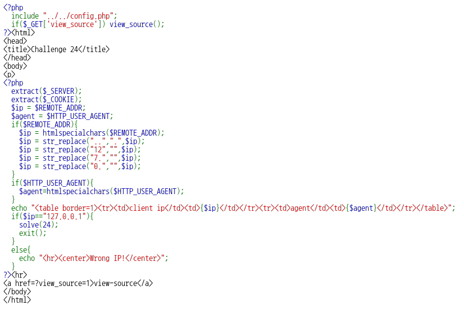
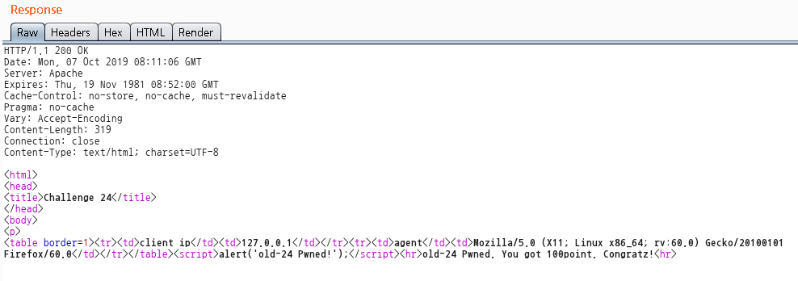

# _Old-24_

**Category:** _Web_

**Source:** _Webhacking.kr_

**Points:** _100_

**Author:** _galaxy(김경환)_

**Description:** 

> 

## Write-up

문제 화면에는 특별한 내용은 안보여서 view-source로 source를 먼저 봤습니다.

최종적으로 $ip가 127.0.0.1이 되어야 합니다.

$ip는 $REMOTE_ADDR에서 가져온 값입니다.

처음에는 X-forward로 값을 바꿔보려 했는데 안됐습니다.

자세히 보니 $\_SERVER 이후에 $\_COOKIE를 extract합니다.

즉 cookie에 REMOTE_ADDR을 넣으면 $ip의 값이 조작 가능합니다.

중간에 보면 $ip를 str_replace로 수정하는 부분이 있습니다.

127.0.0.7에서 거꾸로 올라가면 112277...00...00...1이 됩니다.

이 값을 cookie의 REMOTE_ADDR에 넣어서 request를 보내면 pwned됩니다.

