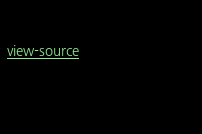
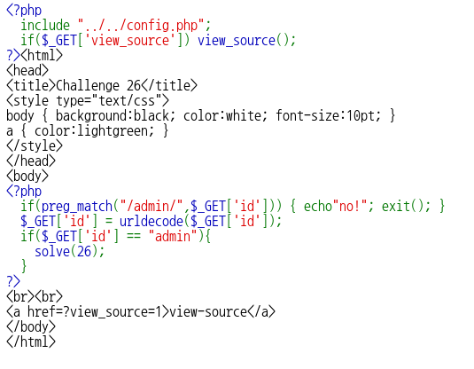
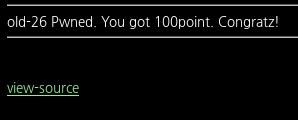

# _Old-26_

**Category:** _Web_

**Source:** _Webhacking.kr_

**Points:** _100_

**Author:** _galaxy(김경환)_

**Description:** 

> 

## Point
url encoding

## Write-up

문제화면에는 아무것도 없이 view-source만 보입니다.

get방식으로 id를 받습니다. id에서 admin글자를 filtering합니다.

그 후 id를 urldecode한 값을 다시 id에 저장합니다.

decoding한값이 admin이면 solve를 호출합니다.

즉 urlencode('admin')한 값을 id에 보내야 합니다.

그래서 admin을 url encoding한 값인 "%61%64%6d%69%6e"을 보냈습니다.

filtering되어서 no!가 출력되었습니다.

다시 생각해보니 request를 보낸 후 값을 읽을때 decoding이 된듯합니다.

그래서 이중으로 encoding한값 "%2561%2564%256d%2569%256e"을 보냈습니다.

첫번째 filtering에서는 한번만 decoding된 값인 "%61%64%6d%69%6e"이 id에 들어있어서 filtering되지 않습니다. 

그 후 urldecode(id)를 거쳐 id에는 admin이 저장됩니다.

