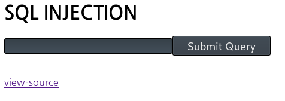
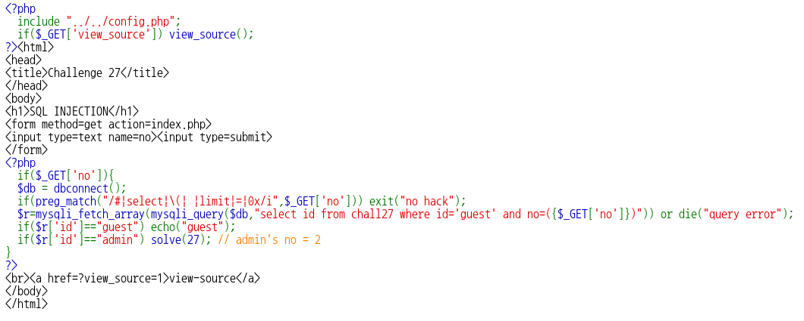
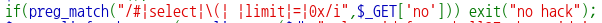
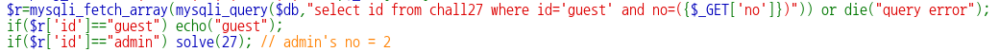
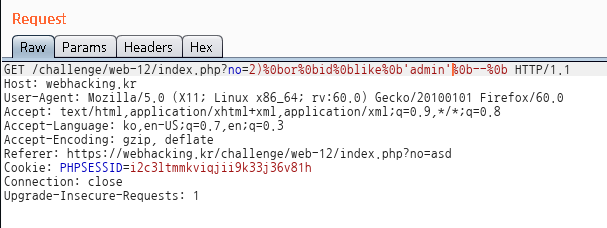
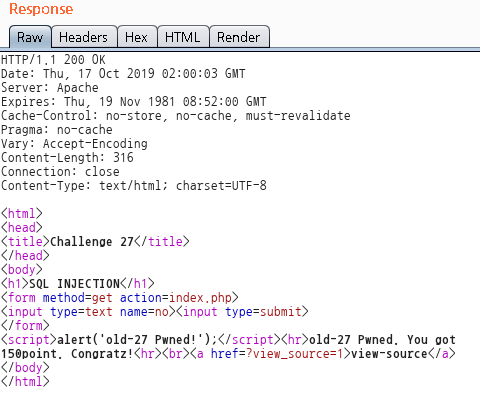

# _Old-27_

**Category:** _Web_

**Source:** _Webhacking.kr_

**Points:** _150_

**Author:** _galaxy(김경환)_

**Description:** 

> 

## Point
sql injection
공백문자 우회

## Write-up

문제 화면에 sql injection이라고 친절히 가르쳐 줍니다.

view-source가 있으니 source부터 봅니다.

get방식으로 no를 받아서 query에 대입합니다.

이때 preg_match로 특정문자들을 filtering합니다.

\#, select, (, limit, =, 0x, 공백문자를 사용할 수 없습니다.

쿼리를 보면 where id='guest' and no=($\_GET['no'])으로 되어있습니다.

밑에 친절하게 admin's no=2라고 알려줍니다. 그러면 아마 guest의 no는 1이라고 생각됩니다.

우선 injection query를 작성해봅니다.

where id='guest' and no=(2) or id='admin' -- 
or
where id='guest' and no=(2) or no=(1) -- 

둘중 하나의 query를 보내면 pwned될 듯 합니다.

이제 preg_match를 우회하기 위해 하나씩 filtering되는 문자들을 우회해 봅니다.

두번째는 no=(1)에서 (를 대체할 방법이 없어서 첫번째 qeury를 사용했습니다.

공백은 %0b로 우회했고, =은 like로 우회했습니다.

최종적으로 우리가 no parameter에 보내야하는 값은

2)%0bor%0bid%0blike%0b'admin'%0b--%0b

입니다.

## References

공백문자 우회
	- https://binaryu.tistory.com/31