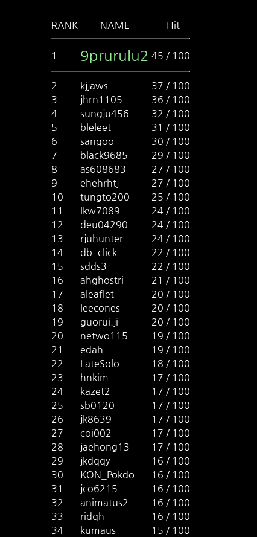
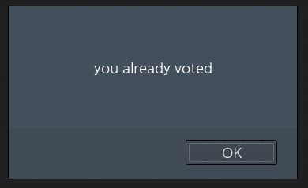
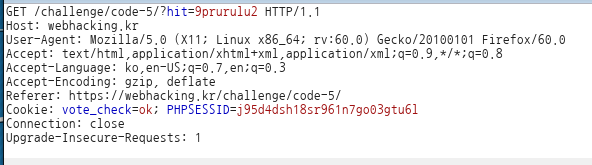

# _Old-32_

**Category:** _Web_

**Source:** _Webhacking.kr_

**Points:** _150_

**Author:** _galaxy(김경환)_

**Description:** 

> 

## Write-up

문제화면에는 랭킹표가 나와있습니다.

이미 풀어서 제 닉네임은 없지만 원래는 제일 마지막에 나타났었습니다.

아무 닉네임을 누르니 투표가 되었고 해당 하는 닉네임의 hit가 올라갔습니다.

100을 채워야 하는 듯해서 제 닉네임을 눌러 보니 이미 투표가 되어서

투표가 불가능 했습니다.



투표를 했는지 안했는지 판단하는 기준이 있을거라 보고 cookie를 보니

vote_check=ok라고 나타나있습니다.



그전의 history에서 투표성공할때의 cookie를 보니 vote_check가 없습니다.

vote_check를 지우니 정상적으로 투표가 됩니다.

이제 100번을 채우면 되니 python script로 진행했습니다.

```python
import requests

url='https://webhacking.kr/challenge/code-5/?hit=galaxy2'
cookies={'PHPSESSID':'j95d4dsh18sr961n7go03gtu6l'}

for _ in range(100):
	response=requests.get(url,cookies=cookies)
```

